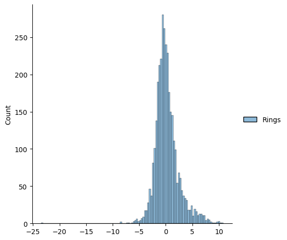

# Abalone Age Predictor

## Overview

This project implements a multiple linear regression model using the Abalone dataset from the UC Irvine Machine Learning Repository. The goal is to predict the age of abalones based on various physical measurements.

## Dataset

The Abalone dataset consists of information about abalones, a type of marine mollusk. Each entry in the dataset includes the following features:

- **Sex**: The sex of the abalone (M, F, and I)
- **Length**: The length of the abalone (in mm)
- **Diameter**: The diameter of the abalone (in mm)
- **Height**: The height of the abalone (in mm)
- **Whole Weight**: The whole weight of the abalone (in grams)
- **Shucked Weight**: The weight of the abalone’s meat (in grams)
- **Viscera Weight**: The weight of the abalone’s gut (in grams)
- **Shell Weight**: The weight of the abalone’s shell (in grams)
- **Rings**: The number of rings on the shell, which can be used to estimate age, which is 1.5 added to the number of rings

For more detailed information, please refer to the [UC Irvine Machine Learning Repository - Abalone Dataset](https://archive.ics.uci.edu/ml/datasets/abalone).

## Implementation

This project uses the `scikit-learn` library to implement a multiple linear regression model. The key steps include:

1. **Data Preprocessing**: Handling categorical variables (sex of the abalone), normalizing the dataset, and splitting the data into training and test sets.
2. **Data Visualization**: Utilizing `seaborn` to plot graphs for better understanding of relationships in the data, including a graph to show the counts of errors against the predicted values.
3. **Model Training**: Fitting the linear regression model to the training data.
4. **Model Evaluation**: Evaluating the model's performance using metrics such as Root Mean Squared Error (RMSE) and R-squared (R²).

## Metrics

- **RMSE**: 2.20281388490066
- **R²**: 0.5089685114567538

## Error Analysis

The notebook includes a section that visualizes the distribution of errors. This graph shows the number of counts of errors against the predicted values, helping to identify patterns or areas for improvement in the model.



## Requirements

To run this project, you'll need:

- Python 3.x
- `scikit-learn`
- `pandas`
- `numpy`
- `seaborn`

You can install the required packages using pip:

```sh
pip install scikit-learn pandas numpy seaborn
```

## Usage

1. Clone the repository.

   ```sh
   git clone https://github.com/yourusername/abalone-regression.git
   ```

2. Navigate to the project directory.

   ```sh
   cd abalone-regression
   ```

3. Open the Jupyter notebook:

   ```sh
   jupyter notebook abalone.ipynb
   ```

4. Run the notebook cells to execute the analysis.

## Conclusion

This project provides a practical application of multiple linear regression using the Abalone dataset. It demonstrates the process of data preprocessing, visualization, model training, and evaluation. 

Feel free to explore and modify the code to enhance the model or experiment with different regression techniques. A potential improvement would be encoding other values to M, F and I, or even separating the three into different models.
